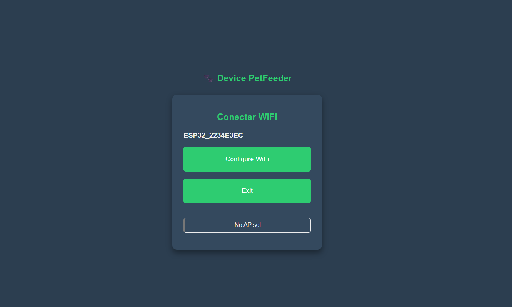
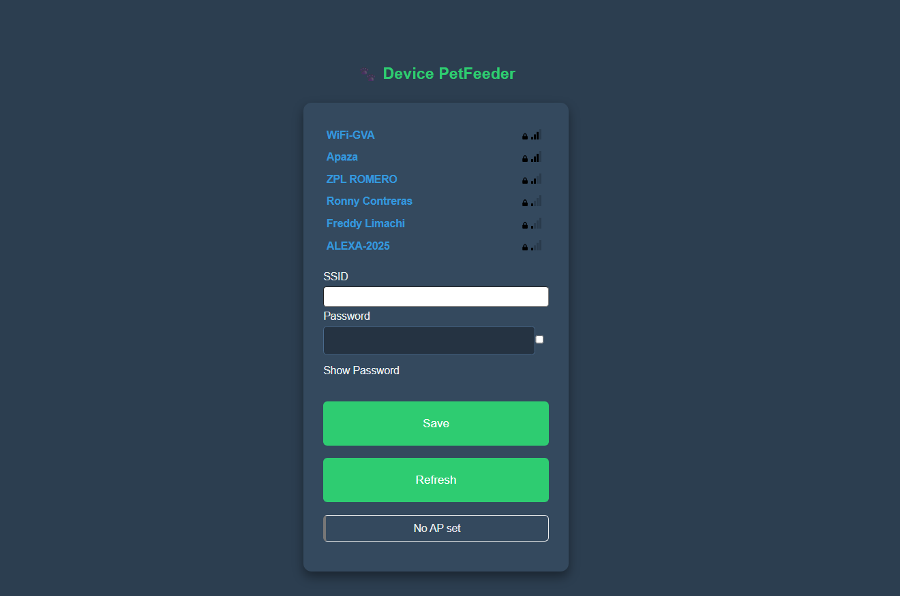
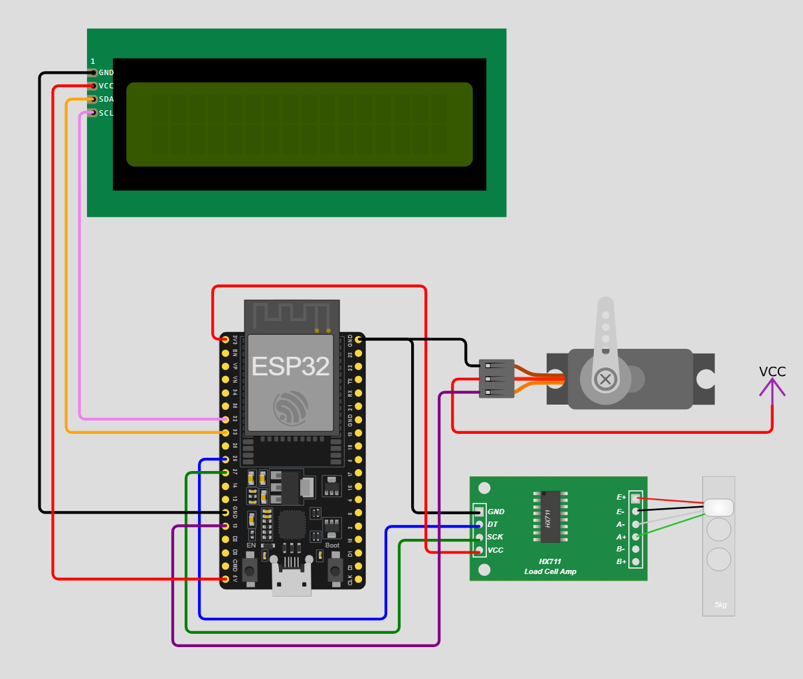

# 🤖 GVA Smart Pet Feeder - ESP32 Firmware

This repository contains the firmware for the **GVA System** ecosystem. It is developed in **C/C++ using PlatformIO**, focusing on real-time hardware control and efficient data transmission via **MQTT**.

---

### 🌐 System Interconnection

This firmware is the "Edge Device" of a complete IoT solution. It communicates with the other layers of the system:

- **[Frontend - Web Dashboard](https://github.com/GVA-987/pet-feeder-control-Web.git):** The user interface for monitoring and control.
- **[Node.js Middleware - MQTT Bridge](https://github.com/GVA-987/pet-feeder-backend.git):** The server that processes MQTT messages and syncs with Firebase.

---

### ✨ Features & Dynamic Provisioning

To avoid hardcoding credentials, I implemented a **Wi-Fi Manager (Captive Portal)**. This allows any user to connect the device to their local network through a web interface generated by the ESP32.

|                        **Access Point Mode**                         |                        **Network Selection**                         |
| :------------------------------------------------------------------: | :------------------------------------------------------------------: |
|  |  |
|            _Device creates its own AP for initial setup._            |         _Responsive UI to scan and save Wi-Fi credentials._          |

---

### 🔌 Hardware Architecture

The system integrates sensors and actuators through a precise wiring scheme to ensure data integrity from the load cell and stable power for the servo.

<p align="center">
  
</p>

**Key Components:**

- **ESP32 DevKit V1:** Main controller.
- **HX711 + Load Cell:** Precision weight sensing for food inventory.
- **Servo Motor:** Controlled PWM for dispensing logic.
- **I2C LCD Display:** Local status monitoring.

---

### 🛠️ Technical Stack

- **Framework:** Arduino / C++ (PlatformIO).
- **Communication:** MQTT (Pub/Sub) via HiveMQ.
- **Libraries:** PubSubClient, HX711, ESP32 Servo, WiFiManager.

---

### 🔑 Security & Configuration

The sensitive credentials (MQTT Broker, and SSL Certificates) are stored in a `Config.cpp` file which is excluded from this repository for security reasons.

To run this project, you must create a `src/config/Config.cpp` file with the following structure:

```cpp
#include <Arduino.h>
#include "Config.h"

// HiveMQ Cloud / MQTT Broker Details
const char *MQTT_SERVER = "your-cluster.s1.eu.hivemq.cloud";
const int MQTT_PORT = 8883; // Standard for MQTTS
const char *MQTT_USER = "your_username";
const char *MQTT_PASS = "your_password";

// Device Identification
String DEVICE_ID = "UNIQUE_DEVICE_ID";
String TOPIC_STATUS = "petfeeder/status/" + DEVICE_ID;
String TOPIC_COMMAND = "petfeeder/command/" + DEVICE_ID;

// HiveMQ Root CA Certificate (For MQTTS)
const char *root_ca PROGMEM = R"EOF(
-----BEGIN CERTIFICATE-----
[INSERT YOUR BROKER'S CA CERTIFICATE HERE]
-----END CERTIFICATE-----
)EOF";
```
